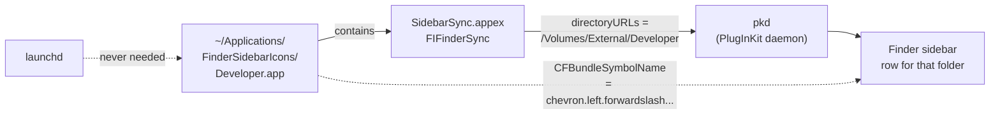

<div align="center">


# FinderSidebarIcons

**Custom icons for any item in the macOS Finder sidebar — the way Dropbox and Google Drive do it.**

No hacks. No SIMBL. No swizzling Finder. Just Finder Sync extensions, built and signed locally in a few seconds.

`macOS 13+` · `Apple Silicon & Intel` · `MIT`

</div>

---

## The problem

You cannot change a Finder sidebar icon by giving the folder a custom icon. This is not a bug you can work around with `SetFile -a C` or an `Icon\r` file: on macOS 13 through 27 the sidebar **ignores folder custom icons** entirely — the custom icon appears in Finder windows and in the Dock, never in the sidebar.

The only supported route is what the cloud-storage apps use: a **Finder Sync extension**. Each extension declares the directory it monitors, and macOS renders the *containing app's icon* next to that directory in the sidebar.

So: one tiny app per folder + icon. That is the whole trick.



The helper app never has to run. `pkd` loads the extension, the extension just declares the folder, and Finder draws the app's icon. Icons survive reboots.

## What it looks like

The custom icons are bare tinted SF Symbols, so they sit next to Finder's own rows without an app-icon plate behind them. Same Finder window — same folder, same view — before and after installing the four icons from `examples/`. The folders themselves are untouched: Finder keeps drawing its normal icons inside the window, only the sidebar rows change.

<p align="center">
  
</p>

The Manager app lists every icon, shows whether its extension is live in PlugInKit, and restarts Finder in one click:

<p align="center">
  
</p>

## Install

Requirements: Xcode command line tools (`xcode-select --install`) and, for icons that stay registered, an Apple Development signing identity (`security find-identity -v -p codesigning`). Ad-hoc signing works locally but `pkd` sometimes refuses to discover the extension.

```bash
git clone https://github.com/ronanrodrigo/finder-sidebar-icons.git
cd finder-sidebar-icons

# pick the real path of a sidebar favourite first — the label lies
make favorites

# one icon
make icon NAME=Developer TARGET="$HOME/Developer" SUFFIX=developer \
          SYMBOL=chevron.left.forwardslash.chevron.right

# or install every icon described in examples/*.json
make examples
```

Then restart Finder (the build script already does it) and look at your sidebar.

### GUI

Prefer clicking? Build the Manager app — a small SwiftUI window that lists the installed icons, adds/edits/removes them, shows each extension's PlugInKit status and restarts Finder with one button.

```bash
make manager          # -> ~/Applications/FinderSidebarIcons Manager.app
open -a "FinderSidebarIcons Manager"
```

It shells out to the same `build_icon_app.sh`, so the GUI and the CLI can never diverge.

## Icon styles

| Mode | What the sidebar shows | How |
| --- | --- | --- |
| `SYMBOLMODE=1` (default) | A bare tinted SF Symbol — identical in weight and colour to Finder's own rows | `CFBundleIcons → CFBundlePrimaryIcon → CFBundleSymbolName` in the app's `Info.plist`, **no `.icns` at all** |
| `SYMBOLMODE=0` + 5th arg | The standard Finder folder icon (blue folder + hammer, + down arrow, + camera…) | pass a CoreTypes `.icns`, e.g. `DeveloperFolderIcon.icns` |
| `SYMBOLMODE=0` | A generated squircle app icon built from an SF Symbol | `make_sidebar_icon.swift` → `.iconset` → `iconutil` |

```bash
# native sidebar glyph (what "make it match the sidebar" means)
make icon NAME=Projects TARGET="$HOME/Projects" SUFFIX=projects SYMBOL=hammer

# the exact icon Finder uses for ~/Downloads
make icon NAME=Downloads TARGET="$HOME/Downloads" SUFFIX=downloads SYMBOL=x \
     SYMBOLMODE=0 \
     SYSICNS=/System/Library/CoreServices/CoreTypes.bundle/Contents/Resources/SidebarDownloadsFolder.icns
```

Browse candidates with a rendered contact sheet before committing to one:

```bash
make symbols HEX=#0083F1      # opens /tmp/symbol-preview.png
```

## Verify

```bash
make status
# +    dev.ronanrodrigo.findericon.developer.sync(1.0)
# +    dev.ronanrodrigo.findericon.downloads.sync(1.0)

killall pkd; sleep 3; killall Finder    # if the icon does not show up yet
```

A leading `+` means the extension is enabled. No line at all means `pkd` never discovered it — see the pitfalls below.

## Uninstall

```bash
make uninstall                 # all of them
make uninstall NAME=Projects   # or remove one app manually
```

Which is really:

```bash
pluginkit -r ~/Applications/FinderSidebarIcons/Projects.app/Contents/PlugIns/SidebarSync.appex
lsregister -u ~/Applications/FinderSidebarIcons/Projects.app
rm -rf ~/Applications/FinderSidebarIcons/Projects.app
killall Finder
```

## Pitfalls

Each of these cost a rebuild while building this. They are the reason the script exists instead of a blog snippet.

- **Icon style.** Shipping an `AppIcon.icns` makes macOS 26 draw the Tahoe app-icon plate (a light rounded square) behind the glyph in the sidebar — it will never match Finder's native rows. For a bare tinted glyph set `CFBundleSymbolName` and ship **no** `.icns`. Finder's accent blue is `#0083F1`.
- **The sidebar label lies.** A favourite displayed as "Downloads" can resolve to `/Volumes/External/Downloads`. Always resolve the real path with `scripts/favlist.swift list` before building.
- **`NSExtensionAttributes` is mandatory.** Without that (even empty) dict in the extension's `Info.plist`, `pkd` never discovers the plugin and Finder logs *"No plugins found to match query"*.
- **Sign the `.appex` first, then the app.** Both need a real identity and the app-sandbox entitlement — every discoverable third-party appex on a stock Mac is sandboxed. Never sign with `--deep`; it breaks extension registration.
- **The sidebar icon is the containing app's icon.** An `.iconset` folder alone renders as the "missing icon" hatch placeholder; `iconutil` must produce a real `.icns` referenced by `CFBundleIconFile`.
- **Restart `pkd`, then Finder.** A single `killall Finder` is not enough for a brand-new extension.
- **Known folders keep their CoreTypes icon** in Finder's list view, no matter what custom icon the folder has. The sidebar is the only place you get to choose.
- **Ad-hoc signing may leave the extension undiscovered.** Use an Apple Development identity when one exists.

## Layout

```
scripts/
  build_icon_app.sh      # build + sign + register one helper app  <- the whole thing
  build_manager.sh       # build the SwiftUI Manager.app
  install_examples.sh    # build every examples/*.json
  Manager.swift          # the GUI
  sync.swift             # the FIFinderSync extension (template)
  favlist.swift          # list/add/remove real sidebar favourites (LSSharedFileList)
  mknative.swift         # render SF Symbol previews / native glyph .iconset
  make_sidebar_icon.swift# squircle app icon from an SF Symbol + sidebar_* templates
  app.entitlements       # app-sandbox entitlement used for both signatures
examples/                # one JSON per sidebar icon
assets/                  # pixel-art icon, green 16:9 banner, README screenshots
```

State: helper apps in `~/Applications/FinderSidebarIcons/`, Manager config in
`~/Library/Application Support/FinderSidebarIcons/config.json`. An example of that
config lives in `assets/example-config.json`.

## References

- Apple, *Extensibility Programming Guide* → **Adding a Sidebar Icon**
- `FIFinderSync`, `LSSharedFileList`, `pkd`, `pluginkit(1)`, `lsregister`

## License

MIT © Ronan Rodrigo Nunes
