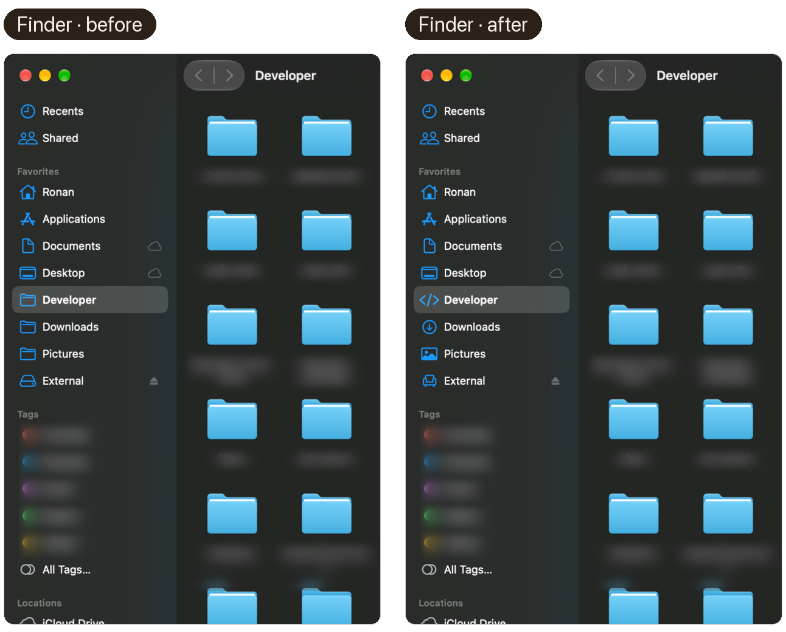
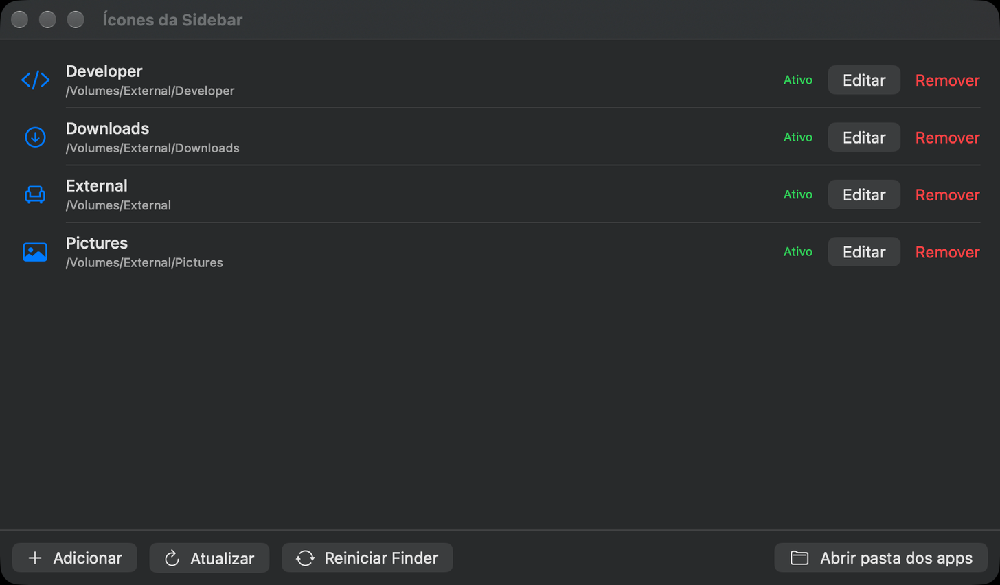

<div align="center">


# Ficoni

**Custom icons for any item in the macOS Finder sidebar.**

`macOS 13+` · `Apple Silicon & Intel` · `MIT`

</div>

---

The sidebar ignores a folder's custom icon — on every macOS since 13. The supported route is what Dropbox and Google Drive use: a tiny Finder Sync extension app per folder. That is all this tool builds.

## What it looks like

Real Finder window, same folder and view, before and after installing the icons from `examples/`:

<p align="center">
  
</p>

The Ficoni app — a real SwiftUI app listing every icon, its PlugInKit status, and a one-click Finder restart:

<p align="center">
  
</p>

## Install

```bash
brew install ronanrodrigo/tap/finder-sidebar-icons
```

Requires the Xcode command line tools (`xcode-select --install`) and an Apple Development signing identity for the extension signature (`security find-identity -v -p codesigning`).

### Without Homebrew

```bash
git clone https://github.com/ronanrodrigo/finder-sidebar-icons.git
cd finder-sidebar-icons
make icon NAME=Developer TARGET="$HOME/Developer" SUFFIX=developer \
          SYMBOL=chevron.left.forwardslash.chevron.right
make examples      # build every icon in examples/*.json
make manager       # build the Manager app
make status        # list the installed extensions
make uninstall
```

## Usage

```bash
sidebar-icon add --name Developer --target "$HOME/Developer" \
  --symbol chevron.left.forwardslash.chevron.right

sidebar-icon examples    # install every icon from examples/
sidebar-icon manager     # build and open the Manager app
sidebar-icon status      # show whether each extension is live
sidebar-icon remove NAME
sidebar-icon uninstall
```

`sidebar-icon help` lists every command and flag.

## Pitfalls

- The sidebar ignores folder custom icons — only the extension app's icon shows.
- The favourite label lies: resolve the real path with `sidebar-icon favorites`.
- Sign the `.appex` before the app, and never with `--deep`.
- The extension's `Info.plist` needs `NSExtensionAttributes`, even if empty.
- Restart `pkd`, then Finder: `killall pkd; sleep 3; killall Finder`.

## License

MIT © Ronan Rodrigo Nunes — [github.com/ronanrodrigo/finder-sidebar-icons](https://github.com/ronanrodrigo/finder-sidebar-icons)
